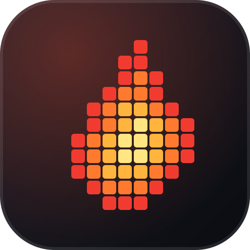

<div align="center">



# doom-fire-kof

**The DOOM fire effect, written in the Kof programming language.**<br>
A 24-bit ANSI terminal version on the JVM and a browser version served by `kof.web`.

[](LICENSE)
[](https://github.com/obrenoalvim/doom-fire-kof/stargazers)
[](https://github.com/KofLang/Kof4j)
[](#run)

**English** · [Português](README.pt-BR.md)

[Requirements](#requirements) · [Run](#run) · [Layout](#layout) · [Build manually](#build-manually) · [FAQ](#faq)

</div>

---

Doom fire effect ([filipedeschamps/doom-fire-algorithm](https://github.com/filipedeschamps/doom-fire-algorithm)) implemented in [Kof](https://github.com/KofLang/Kof4j).

## Requirements

The Kof toolchain, which is not committed to this repo. This project was built with `kof-0.3.23-beta-windows-x86_64`. Download its `.zip` from the [Kof4j releases](https://github.com/KofLang/Kof4j/releases) and extract it so that this path exists:

```
toolchain\win-native\kof-0.3.23-beta-windows-x86_64\bin\kof.bat
```

You can also edit the `KOF` variable at the top of `run.bat` and `serve.bat` to point at your own `kof.bat`.

## Run

Terminal (24-bit ANSI, loops forever):
```
run.bat
```

Browser, served by `kof.web`:
```
serve.bat
```
then open http://localhost:8080/

## Layout

- `src/cli/Main.kf`, terminal version, JVM target, `while (true)` render loop
- `src/server/Server.kf`, `kof.web` app serving `src/web/` as static files
- `src/web/index.html`, same algorithm ported to canvas/JS for the browser

Each `.kf` program lives in its own directory. `kof run` compiles every file in a program's folder together, so two `main()` functions can't share one.

## Build manually

```
toolchain\win-native\kof-0.3.23-beta-windows-x86_64\bin\kof.bat run src\cli\Main.kf --target jvm
toolchain\win-native\kof-0.3.23-beta-windows-x86_64\bin\kof.bat run src\server\Server.kf --target jvm
```

Native (`--target native`) needs a GNU `as` on PATH (MinGW/binutils). Not installed on this machine, so that target is untested here.

---

## FAQ

**What is Kof?**
A language and compiler from the [Kof4j](https://github.com/KofLang/Kof4j) project. This repo is a small program written in it: the classic DOOM fire effect.

**Where does the algorithm come from?**
From [doom-fire-algorithm](https://github.com/filipedeschamps/doom-fire-algorithm) by Filipe Deschamps. This repo ports it to Kof for the terminal and to canvas for the browser.

**Does it run on Linux or macOS?**
The helper scripts are Windows batch files. On other systems, run the `kof run` commands from [Build manually](#build-manually) with the toolchain for your platform.

**Does the native target work?**
It is untested. It needs a GNU `as` on the PATH, and it is not installed on the machine this was built on.

## More from the same author

- [**echoport**](https://github.com/obrenoalvim/echoport): a real-time localhost port scanner for developers.
- [**github-wrapped**](https://github.com/obrenoalvim/github-wrapped): a Spotify-Wrapped-style poster for your GitHub year.

## License

[MIT](LICENSE)

---

<div align="center">

If the flames made you smile, a ⭐ helps other people find it.

<sub>**Topics:** doom-fire-algorithm · fire-effect · kof · kof-lang · jvm · terminal · ansi-colors · canvas-animation · programming-language · compiler</sub>

</div>
